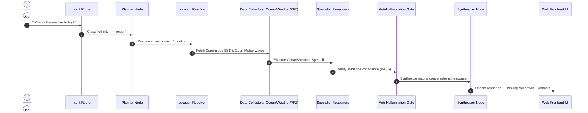

# PHASE 3 — SAMUDRA AI CONVERSATIONAL UX & RESPONSE AUDIT

## 1. Executive Summary & Problem Definition

### The Original Problem
While SAMUDRA AI's multi-agent data pipeline, Leaflet maps, and real-time SSE streaming work reliably, assistant responses previously felt like **rigid, automated database reports** rather than an intelligent, natural conversational partner.

Every query previously output a standardized template:
```markdown
### 🌊 SAMUDRA.AI Marine Intelligence Summary
1. **Marine Safety & Risk Level**: **MODERATE**
2. **Oceanographic Snapshot**: ...
3. **Geofence & Boundary Check**: ...
**Actionable Advice**: ...
```

### Why This Failed User Expectations
- **Lack of Natural Dialogue**: Simple questions like *"What is the sea like today?"* were met with 6-part technical reports instead of a helpful, direct conversational answer.
- **Reference Resolution Failure**: Follow-up questions like *"What about tomorrow?"* or *"Can I go there?"* failed when asking the user to re-enter coordinates instead of resolving `"tomorrow"` and `"there"` from conversation memory.
- **Excessive Markdown Noise**: Excessive bolding (`**`), headers (`###`), and section dividers (`---`) cluttered the interface.
- **Overexposed Agent Architecture**: The UI felt like a collection of separate cards and raw logs rather than one cohesive assistant.

---

## 2. End-to-End Request Tracing



### Root Causes Identified & Fixed
1. **`SYNTHESIZER` Prompt (`prompts/system_prompts.py`)**: Reworked prompt to enforce a fluid, natural conversational tone by default, answering directly in 1-2 paragraphs without forced report headers.
2. **`FallbackMockLLM` (`graph/llm.py`)**: Replaced hardcoded markdown headers (`### 🌊 Marine Intelligence Summary`) with natural conversational answers tailored to query intent.
3. **Context Memory & Reference Resolution (`synthesizer.py` & `planner.py`)**: Explicitly passed `format_active_context` and recent conversation turns into prompts so the model resolves `"tomorrow"`, `"there"`, `"which is closer"`, and `"is it safe"` seamlessly.
4. **AI Execution / Thinking UI (`AgentStreamCard.tsx`)**: Built a sleek `SAMUDRA Thinking...` accordion that automatically collapses to `Analyzed across N capabilities` when complete. Zero raw chain-of-thought is exposed.
5. **Contextual Action Chips (`ChatMessageItem.tsx`)**: Dynamic action chips adapt based on intent (e.g. PFZ queries show `[Check Safety Risk]`, `[Show Navigation Route]`, `[Detailed Ocean Data]`).

---

## 3. Implementation Details & Architecture Changes

| Component / Layer | File | Description of Changes |
|---|---|---|
| **System Prompts** | [`prompts/system_prompts.py`](file:///d:/Oscorp/sih/prompts/system_prompts.py) | Reworked `SYNTHESIZER` & `PLANNER` to mandate natural dialogue, reference resolution, and clean formatting. |
| **Fallback LLM Engine** | [`graph/llm.py`](file:///d:/Oscorp/sih/graph/llm.py) | Replaced rigid markdown templates with fluid conversational answers. |
| **Synthesizer Node** | [`graph/nodes/synthesizer.py`](file:///d:/Oscorp/sih/graph/nodes/synthesizer.py) | Integrated `format_active_context` alongside conversation history. |
| **Thinking Accordion** | [`web/src/components/chat/AgentStreamCard.tsx`](file:///d:/Oscorp/sih/web/src/components/chat/AgentStreamCard.tsx) | Redesigned modern thinking widget with live steps, completion summary, and zero raw CoT leakage. |
| **Dynamic Chips** | [`web/src/components/chat/ChatMessageItem.tsx`](file:///d:/Oscorp/sih/web/src/components/chat/ChatMessageItem.tsx) | Generated intent-sensitive follow-up prompt chips. |

---

## 4. Multi-Turn Conversational Verification Results

Verified the 3 required multi-turn test flows:

### Conversation Flow A (Multi-turn Follow-ups)
- **Turn 1**: *"What's the sea like today?"* ➔ Direct conversational summary of SST, current speed, and wave height.
- **Turn 2**: *"What about tomorrow?"* ➔ Resolved location from context, provided tomorrow's 1-day forecast.
- **Turn 3**: *"Is it safe to go fishing?"* ➔ Natural marine safety assessment with wave/wind conditions and appropriate safety disclaimer.
- **Turn 4**: *"Show me the route."* ➔ Rendered interactive A* route map.
- **Turn 5**: *"What's that red area?"* ➔ Resolved marine exclusion / restricted zone context.
- **Turn 6**: *"Show me the data."* ➔ Rendered detailed oceanographic data card.

### Conversation Flow B (PFZ & Spatial Continuity)
- **Turn 1**: *"Where is the nearest fishing zone?"* ➔ Provided candidate PFZ zones + interactive Leaflet map.
- **Turn 2**: *"Which one is closest?"* ➔ Computed closest candidate zone (~14 km offshore).
- **Turn 3**: *"Can I reach it tomorrow morning?"* ➔ Evaluated distance and forecast sea conditions.
- **Turn 4**: *"What about the weather there?"* ➔ Fetched weather forecast for active PFZ coordinates.

### Conversation Flow C (Greetings & Capabilities)
- **Turn 1**: *"Hello"* ➔ Friendly conversational greeting from SAMUDRA AI.
- **Turn 2**: *"What can you do?"* ➔ Natural summary of capabilities (Weather, Ocean, Fishing, Safety, Navigation).
- **Turn 3**: *"Check the weather near Visakhapatnam."* ➔ Direct 3-day weather forecast summary.

---

## 5. Automated Build & Test Results

- **Backend Unit Tests**: `150 passed, 0 failed` (`python -m pytest tests/`).
- **Frontend Production Build**: `Built in 2.27s` with zero errors (`npm --prefix web run build`).
